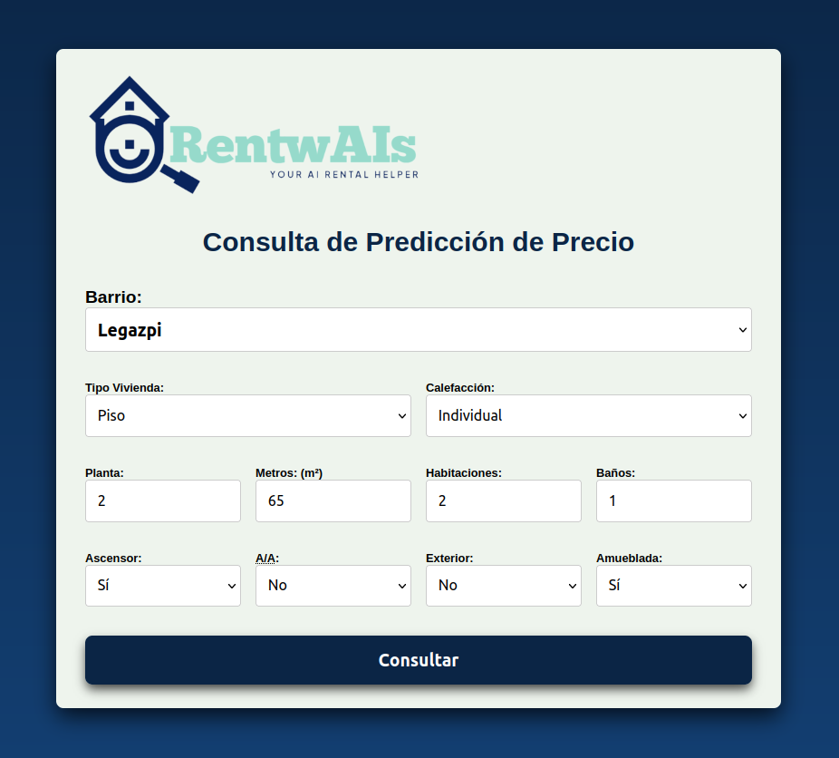
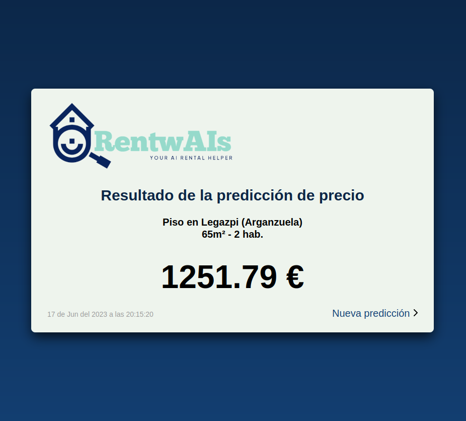

# RentwAIs

## Your AI rental helper

### Proyecto para Saturday's AI Madrid - Junio 2023

 

El objetivo inicial del proyecto: detectar fraudes en alquileres de pisos en portales inmobiliarios.

La limitación de los datos disponibles hizo modificar el enfoque del proyecto y predecir una estimación del precio de la propiedad para poder comparar, ya que no se dispone de datos no sesgados que prueben los anuncios que realmente son fraude.

Se ha desarrollado un modelo de aprendizaje automático para predecir los precios de propiedades en Madrid capital usando RandomForestRegressor.

__Este repositorio contiene la aplicación web en Flask que sirve para consultar estimaciones al modelo. Si busca el modelo está en el repositorio [/rentwais/model](https://github.com/rentwais/model).__

También se puede consultar más información en el [artículo de Medium](https://medium.com/@javier.lr/rentwais-predicción-de-precio-de-alquiler-de-vivienda-d6c6b8a7214f).

---

# Instalación

Será necesario instalar algunas librerías requeridas antes de poder probarlo:

    - Flask
    - Numpy

### PIP
se pueden instalar mediante el comando:

    pip install flask, numpy

o usando el archivo de requirements:

    pip install -r requirements.txt

### Conda
o usando conda:

    conda install flask, numpy

o usando el archivo de requirements:

    conda install --yes --file requirements.txt

#### Requirements.txt:
    flask
    numpy

## Ejecución del servidor web

Una vez instaladas las librerías necesarias, se inicia el servidor web de Flask para poder probar el modelo en un navegador web.

    python app.py

Levantará el servidor en localhost ( *http://127.0.0.1:5000* ) por el puerto 5000, donde se muestra lo que haya en la ruta inicial <code>'/'</code> 

# Variables de configuracion:

El archivo <code>'configData.py'</code> contiene variables necesarias para realizar el **mapeo de los distritos de cada barrio**, así como otras variables como lista de **features** o **numero de parámetros total** de la entrada de predicción del modelo.

# Screenshots

### Homepage 

### Página de resultados 

